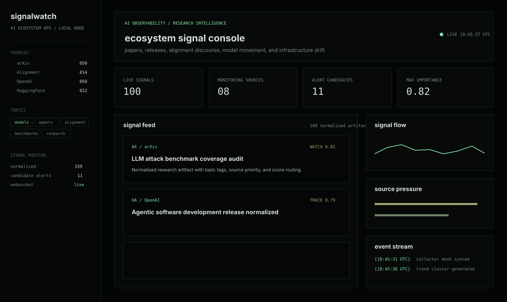
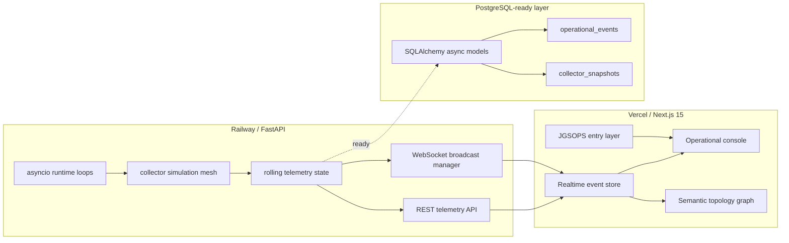

<p align="center">
  
</p>

<h1 align="center">SIGNALWATCH</h1>

<p align="center">
  Realtime observability systems for monitoring intelligent infrastructure.
</p>

<p align="center">
  
  
  
  
  
  
</p>

---

## Overview

SIGNALWATCH is an AI ecosystem observability console.

It monitors operational signals across research, alignment discourse, policy movement, model velocity, collector health, source latency, semantic clusters, and ecosystem drift. The system is designed to feel less like a static analytics dashboard and more like a quiet operations room: a realtime surface for watching intelligent infrastructure change over time.

The production surface runs at `jgsops.dev`. The frontend is deployed on Vercel. The FastAPI realtime backend is deployed on Railway.

## Operational Capabilities

- Realtime operational event stream over WebSockets.
- Live telemetry snapshot over REST.
- Collector health and reconnect state simulation.
- Source latency and reliability tracking.
- Rolling signal feed derived from live backend frames.
- Semantic topology graph generated from cluster and source relationships.
- Trend pressure, alignment drift, and heartbeat telemetry.
- Dark operational console UI with restrained motion and dense scanability.

## Realtime Infrastructure

The backend emits a continuous operational stream through:

```text
wss://signalwatch-production-4416.up.railway.app/ws/events
```

The frontend consumes the stream through a typed client hook with:

- snapshot ingestion
- rolling event buffer
- automatic reconnect
- connection state reporting
- live metric synchronization
- telemetry-driven UI pulse states

The browser never appends route suffixes blindly. `NEXT_PUBLIC_WS_URL` may contain the full websocket endpoint.

## Architecture



## Telemetry Pipeline

```text
collector loop
  -> health snapshot
  -> source latency frame
  -> rolling reliability model
  -> telemetry snapshot
  -> REST response
  -> websocket heartbeat
  -> console metric rail
```

Signals are intentionally operational, not editorial. A frame may describe a semantic cluster, alignment drift, collector reconnect, trend spike, latency elevation, or policy update indexing event.

Example event classes:

```text
signal.event
telemetry.update
collector.health
source.latency
semantic.cluster
watcher.reconnect
trend.spike
alignment.alert
system.heartbeat
```

## WebSocket Streaming

Clients connect to:

```text
/ws/events
```

The first frame is a recent history snapshot. Subsequent frames arrive every few seconds from the async runtime.

```json
{
  "type": "alignment.alert",
  "severity": "elevated",
  "source": "alignment discourse monitor",
  "message": "alignment drift increasing",
  "payload": {
    "latency_ms": 214.8,
    "drift": 0.63,
    "pressure": 0.72,
    "confidence": 0.91
  }
}
```

The console treats this stream as the source of truth once connected.

## Semantic Clustering

The topology layer renders semantic clusters and source relationships as a calm systems graph:

- cluster nodes
- source nodes
- thin animated edges
- slow topology drift
- hover inspection
- no particles
- no neon overload

The intent is to convey a living correlation map without turning the interface into a visual effect.

## Deployment Stack

```text
domain       jgsops.dev
frontend     Vercel / Next.js 15 / TypeScript / Tailwind
backend      Railway / FastAPI / uvicorn / asyncio
realtime     WebSocket stream at /ws/events
telemetry    REST API at /api/telemetry
storage      PostgreSQL-ready SQLAlchemy async layer
container    Docker
```

Production environment variables:

```env
NEXT_PUBLIC_API_URL=https://signalwatch-production-4416.up.railway.app
NEXT_PUBLIC_WS_URL=wss://signalwatch-production-4416.up.railway.app/ws/events
SIGNALWATCH_CORS_ORIGINS=https://jgsops.dev,https://www.jgsops.dev,http://localhost:3000,http://127.0.0.1:3000
```

## Visual System

SIGNALWATCH uses a quiet mission-control aesthetic:

- dark operational surfaces
- thin borders
- small typography
- restrained green/olive/amber signal hierarchy
- slow pulses on live telemetry
- dense but readable event streams
- minimal cinematic landing layer

It avoids startup landing-page language, neon cyberpunk treatment, oversized marketing cards, and decorative effects that obscure the system state.

## Visual Roadmap

Recommended repository assets:

```text
assets/screenshots/landing.png          # first viewport JGSOPS entry layer
assets/screenshots/console.png          # full operational console
assets/screenshots/topology.png         # semantic topology graph close-up
assets/demo/realtime-stream.gif         # websocket event stream receiving frames
assets/demo/metric-pulse.gif            # telemetry cards updating live
assets/diagrams/runtime-architecture.svg
assets/diagrams/telemetry-pipeline.svg
```

Suggested GitHub README layout:

```text
[wide console screenshot]

SIGNALWATCH
Realtime observability systems for monitoring intelligent infrastructure.

[architecture diagram]
[realtime stream gif]
[semantic topology close-up]
```

## Local Operation

Backend:

```bash
cd backend
pip install -r requirements.txt
uvicorn app.main:app --reload
```

Frontend:

```bash
cd frontend
npm install
npm run dev
```

Docker:

```bash
docker compose up --build
```

Local endpoints:

```text
frontend     http://localhost:3000
console      http://localhost:3000/console
backend      http://localhost:8000
telemetry    http://localhost:8000/api/telemetry
websocket    ws://localhost:8000/ws/events
```

## Design Principle

The interface should feel like a living AI ecosystem monitoring system quietly observing the evolution of intelligent infrastructure.

The work is not to make signals louder. The work is to make movement legible.
