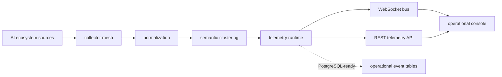

<p align="center">
  
</p>

<h1 align="center">SIGNALWATCH</h1>

<p align="center">
  Realtime observability infrastructure for monitoring intelligent systems.
</p>

<p align="center">
  <a href="https://jgsops.dev">jgsops.dev</a>
  <span>&nbsp;&nbsp;/&nbsp;&nbsp;</span>
  <a href="https://jgsops.dev/console">operational console</a>
</p>

<p align="center">
  
  
  
  
  
  
</p>

---

## Overview

SIGNALWATCH is an AI ecosystem observability console: a realtime operational telemetry surface for watching research movement, alignment discourse, release activity, semantic clusters, collector health, source latency, and ecosystem drift.

It is designed as infrastructure, not as a generic analytics view. The console behaves like an internal operations surface: dense, dark, quiet, and continuously updated by a live WebSocket runtime.

The system tracks:

- research and capability signals
- alignment and safety discourse
- model and policy release movement
- semantic cluster formation
- source latency and collector health
- trend pressure and ecosystem drift
- operational severity routing

## Operational Surface

SIGNALWATCH presents live backend activity as a calm mission-control interface.

```text
signal frames       alignment drift increasing
collector state     reconnect successful
source latency      elevated
semantic topology   cluster detected
runtime heartbeat   operational
```

The interface is intentionally restrained. Motion is used to indicate liveness, not spectacle. The system should feel like it is quietly observing intelligent infrastructure as it changes.

## Realtime Infrastructure

The runtime follows a systems pipeline:

```text
AI ecosystem sources
        |
        v
collector mesh
        |
        v
normalization layer
        |
        v
semantic clustering
        |
        v
telemetry runtime
        |
        v
WebSocket event bus
        |
        v
operational console
```

Runtime behavior:

- async FastAPI service on Railway
- continuous operational event generation
- rolling telemetry state
- collector health snapshots
- source latency frames
- WebSocket snapshot on connect
- automatic frontend reconnect
- live metric synchronization

Production endpoints:

```text
REST       https://signalwatch-production-4416.up.railway.app/api/telemetry
WebSocket  wss://signalwatch-production-4416.up.railway.app/ws/events
Console    https://jgsops.dev/console
```

## Architecture

```text
                                    JGSOPS / SIGNALWATCH

     +----------------------+        +----------------------+        +----------------------+
     |  ecosystem sources   |        |  FastAPI runtime     |        |  Next.js console     |
     |----------------------|        |----------------------|        |----------------------|
     |  research streams    | -----> |  asyncio loops       | -----> |  realtime store      |
     |  alignment discourse |        |  collector simulator |        |  metric rail         |
     |  release movement    |        |  telemetry state     |        |  event stream        |
     |  policy updates      |        |  websocket manager   |        |  topology graph      |
     +----------------------+        +----------------------+        +----------------------+
                                                |
                                                v
                                      +----------------------+
                                      |  PostgreSQL-ready    |
                                      |----------------------|
                                      |  operational_events  |
                                      |  collector_snapshots |
                                      +----------------------+
```

System map:



## Stack

Frontend:

```text
Next.js 15
TypeScript
TailwindCSS
Framer Motion
Recharts
```

Backend:

```text
FastAPI
asyncio
WebSockets
PostgreSQL-ready SQLAlchemy layer
```

Infrastructure:

```text
Vercel frontend
Railway backend
Docker containerization
custom domain at jgsops.dev
```

## Operational Capabilities

### Realtime Event Stream

The console receives operational frames over `/ws/events`. New frames enter a rolling event buffer with severity-aware styling, timestamp rhythm, heartbeat cadence, and connection-state recovery.

Event classes:

```text
signal.event
telemetry.update
collector.health
source.latency
semantic.cluster
watcher.reconnect
trend.spike
alignment.alert
system.heartbeat
```

### Semantic Topology Graph

The topology view renders semantic clusters, monitored sources, and relationship edges as a low-motion systems graph. It uses thin lines, slow drift, and muted operational color to preserve legibility.

### Live Telemetry Metrics

The metric rail synchronizes with backend telemetry:

```text
signal velocity
collector latency
collector reliability
semantic cluster count
trend pressure
alignment drift
active websocket clients
```

### Collector Health

Collectors publish online, degraded, reconnecting, and offline states. The UI reflects activity with small health dots, restrained pulses, retry counts, artifact totals, and latency readouts.

### WebSocket Synchronization

The frontend accepts a full `NEXT_PUBLIC_WS_URL` endpoint and does not append route suffixes blindly. Connections receive an initial snapshot, then live frames. Disconnects trigger controlled reconnect behavior.

### Ecosystem Signal Ingestion

Signals are modeled as operational observations rather than editorial content. The console treats research, alignment, policy, release, and infrastructure movement as monitored surface area.

### Severity Routing

Frames are routed through a small severity vocabulary:

```text
TRACE
WATCH
ELEVATED
ALERT
CRITICAL
```

Severity informs hierarchy, not noise.

## Visual Showcase

### Landing Layer

The public entry surface is intentionally minimal: JGSOPS, a concise operational statement, and a short boot transition into the console.

```text
assets/screenshots/landing.png
```

Recommended frame:

<p align="center">
  
</p>

### Operational Console

The console is the primary surface: metrics, event stream, collector health, topology, charts, and live signal feed.

```text
assets/screenshots/console.png
```

<p align="center">
  
</p>

### Semantic Topology

Close-up capture of semantic cluster nodes, source nodes, and animated relationship edges.

```text
assets/screenshots/topology.png
assets/demo/topology-drift.gif
```

### Realtime Stream

Short loop showing WebSocket frames entering the operational event stream.

```text
assets/demo/realtime-stream.gif
assets/demo/metric-pulse.gif
```

Recommended README visual order:

```text
wide console preview
architecture diagram
landing screenshot
topology close-up
realtime stream gif
```

## Design Philosophy

SIGNALWATCH follows an observability-first design language.

The interface should feel like quiet mission control: dark surfaces, thin borders, precise typography, dense data, small pulses, and controlled transitions. It does not try to explain itself like a SaaS homepage. It presents operational state and lets the system breathe.

Avoided deliberately:

- cyberpunk overload
- startup gradients
- decorative AI wrapper patterns
- oversized marketing cards
- animation for its own sake
- tutorial-style UI language

The visual system is built for scanability, continuity, and trust. Motion is slow. Color is sparse. Telemetry remains the center of gravity.

## Deployment

Production:

```text
domain     https://jgsops.dev
console    https://jgsops.dev/console
```

Frontend:

```text
platform   Vercel
runtime    Next.js 15
```

Backend:

```text
platform   Railway
runtime    FastAPI / uvicorn
REST       /api/telemetry
WebSocket  /ws/events
```

Environment:

```env
NEXT_PUBLIC_API_URL=https://signalwatch-production-4416.up.railway.app
NEXT_PUBLIC_WS_URL=wss://signalwatch-production-4416.up.railway.app/ws/events
SIGNALWATCH_CORS_ORIGINS=https://jgsops.dev,https://www.jgsops.dev,http://localhost:3000,http://127.0.0.1:3000
```

## Repository Structure

```text
signalwatch/
  frontend/       Next.js operational console
  backend/        FastAPI realtime runtime
  docker/         container definitions
  assets/         screenshots, demos, diagrams
```

## Closing

Monitoring the operational surface of intelligent infrastructure.
